 

### Building digital products with clarity, curiosity, and care.

I am a third-year Computer Science student and junior frontend developer based in Addis Ababa, Ethiopia. I build responsive interfaces with React, explore data engineering, and learn by turning ideas into working products.

 

  

 

---

## A little about me

I care about the space between **good engineering** and **good experience**. My work is focused on interfaces that are accessible, responsive, performant, and easy to understand.

At the moment, I am:

- Building polished React applications with JavaScript and Tailwind CSS
- Strengthening my foundations in SQL, databases, and data engineering
- Exploring practical applications of AI and automation
- Growing through hands-on work as a Software Development Intern at Codveda Technologies

> “I would rather understand why something works than only make it work.”

 

## What I work with

### Frontend

### Tools

### Learning now

 

## Selected work

<table>
  <tr>
    <td width="50%" valign="top">
      <h3>DevFlow</h3>
      
A focused React dashboard for tracking learning progress, streaks, goals, and projects.

      
<strong>Highlights:</strong> performance-first UI, responsive layouts, and a clean productivity workflow.

      

        
        
      

      <a href="https://natdevflow.netlify.app">Live demo</a> ·
      <a href="https://github.com/nathnaelashenafi/devflow">Source code</a>
    </td>
    <td width="50%" valign="top">
      <h3>NexaAI</h3>
      
A frontend concept exploring AI-inspired interfaces and thoughtful interaction design.

      
<strong>Focus:</strong> modern UI patterns, responsive behavior, and a calm visual system.

      

        
        
      

    </td>
  </tr>
  <tr>
    <td width="50%" valign="top">
      <h3>Weather App</h3>
      
A practical project for learning live API integration, asynchronous JavaScript, and dynamic rendering.

      

        
        
      

    </td>
    <td width="50%" valign="top">
      <h3>React Calculator</h3>
      
A small, deliberate project built while learning React state, event handling, and component structure.

      

        
        
      

    </td>
  </tr>
</table>

 

## Experience and education

<table>
  <tr>
    <td width="18%" valign="top"><strong>2026</strong></td>
    <td valign="top"><strong>Software Development Intern · Codveda Technologies</strong> Frontend development, performance optimization, and debugging across real project tasks.</td>
  </tr>
  <tr>
    <td width="18%" valign="top"><strong>2026</strong></td>
    <td valign="top"><strong>ALX Africa · Virtual Assistant Certificate</strong> Google Workspace, organization, online research, and practical productivity workflows.</td>
  </tr>
  <tr>
    <td width="18%" valign="top"><strong>2023 —</strong></td>
    <td valign="top"><strong>BSc Computer Science · Unity University</strong> Building a strong foundation in software development, systems, and data.</td>
  </tr>
</table>

 

## GitHub at a glance

## GitHub at a glance

  

 

## Beyond the screen

When I am not building, I am usually studying, documenting what I learn, or looking for a better way to simplify a problem. I believe progress compounds through small, consistent improvements.

  

Designed with intention · built with curiosity · always learning

